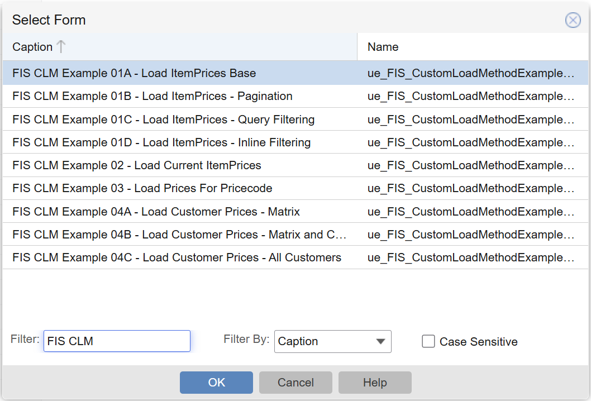
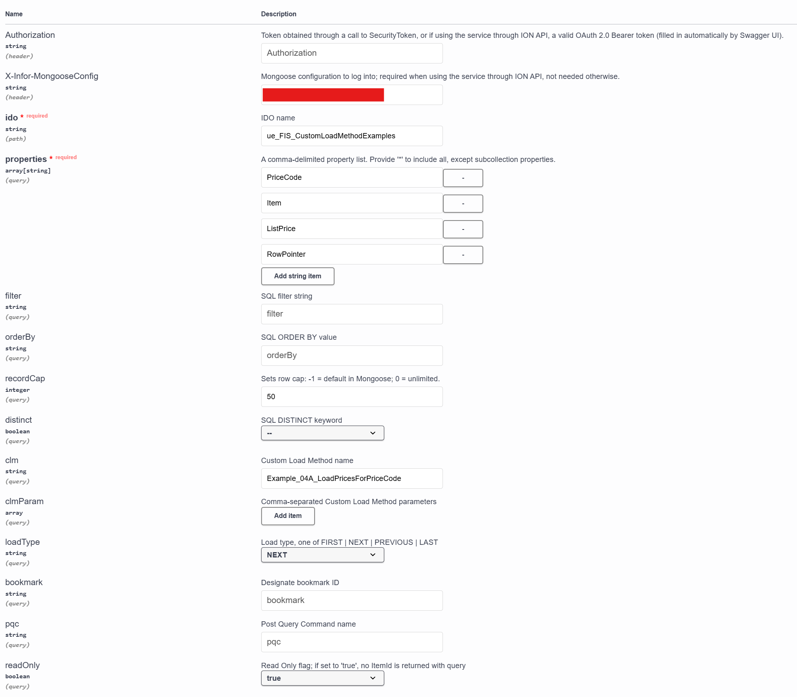

# 2026 SUN Conference Session - Custom Load Method Extension Classes: How-Tos and Performance Tips

The repo contains a series of examples of Custom Load Method that go along with the ["Custom Load Method Extension Classes: How-Tos and Performance Tips"](https://www.sytelineusernetwork.com/assets/ConferenceInfo/Atlanta%202026%20Session%20List%20as%20of%20Oct%2026%202025.pdf) session for the [2026 Syteline User Network Conference](https://www.sytelineusernetwork.com/conference).

> [!WARNING]
> This repo is not finished. It only contains the first four examples. Example five will be added before the conference in March.

## Overview

The repo contains an IDO and a series of Mongoose forms which can be imported to your Syteline instance, in order to test out the example CLMs which will be convered in the session. There are five examples, some of which have multiple variations which are separated in order to fully explain how different functionality works.

## Setup

1. Import the `IDOs.XML` file into your Syteline instance using the IDO Import Wizard form.
2. Import the `Mongoose Items.XML` file into your Syteline instance using the FormSync form.

## Usage

To test using Mongoose forms, open the Form -> Open popup menu, search captions for "FIS", and you should see:

You can also test using the Infor OS API Gateway:

